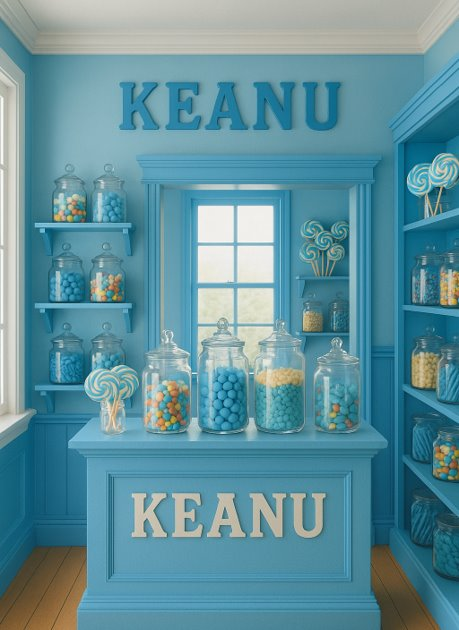

# CandyStore-ClassDiagram

*Store image created by Kean University student Christopher Paredes*

This code sample was created for a Software Engineering course to demonstrate class diagrams, using Keanu's Candy Store at Kean University as the case study.

## Educational Use

This repository is intended for educational purposes as part of Kean University's CPS 5301 Advanced Software Engineering course. The code demonstrates object-oriented programming concepts, class relationships, and design patterns through a candy store management system.

## Attribution

- **Store Image**: Created by Christopher Paredes, Kean University student
- **Code Implementation**: Educational demonstration for CPS-5301 Software Engineering course
- **Institution**: Kean University

## License

This project is for educational use only. All rights reserved.
